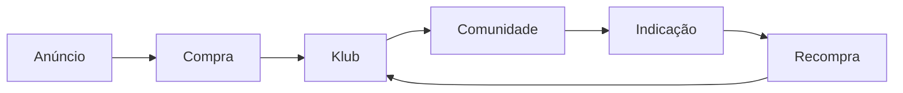
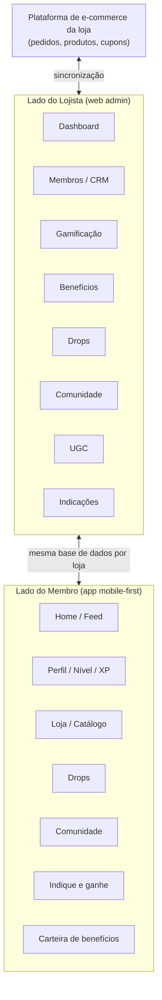

# PRD — Klub Members

> Documento vivo. Versão 0.1 — 2026-08-19.

## 1. Visão geral

**Klub** (nome interno: *Klub Members*) é um **clube de membros para e-commerces** — um app white-label que cada loja ativa dentro da própria operação para transformar compradores avulsos em uma comunidade recorrente.

Proposta de valor, em uma frase: **aumentar o LTV, reduzir o CAC, vender mais através de senso de comunidade e gamificação.**

O produto se apoia em 3 pilares primordiais:

| Pilar | Promessa | Mecânica |
|---|---|---|
| **Rewards** | Compre. Participe. Evolua. Desbloqueie. | Gamificação + níveis + pontos (XP) + benefícios |
| **Drops** | Quem está no Klub compra primeiro. | Ofertas exclusivas + lançamentos + acesso antecipado + cupons |
| **Community** | Clientes que compram. Clientes que compartilham. | UGC orgânico + avaliações + discussões + desafios + indicações |

### O problema

O funil padrão de aquisição paga está achatado e caro:

```
Meta Ads → Anúncio → Compra → Acabou
```

Cada venda começa do zero: o CAC não se paga em recorrência, o cliente não tem motivo para voltar, e a loja não tem um canal próprio para reengajar sem pagar de novo por mídia.

### A mudança que o Klub propõe



O Klub insere um passo entre "comprar" e "esquecer": a compra vira **entrada** em um clube, não o fim da jornada. Resumindo a mudança de mentalidade que o produto vende para o lojista:

> Loja → "quero comprar." <br>
> Klub → "quero fazer parte."

### Objetivo do produto

Dar a qualquer e-commerce, sem equipe de engenharia própria, uma área de membros gamificada e uma comunidade — configurável pelo lojista, consumida pelo cliente final em uma experiência **mobile-first, indistinguível de um app nativo**.

### Fora de escopo (v1)

- Checkout próprio — o Klub não substitui a loja/plataforma de e-commerce, ele se conecta a ela (pedidos, produtos, cupons são espelhados/sincronizados, não recriados).
- App nativo iOS/Android publicado nas lojas (v1 é PWA "app-like"; nativo entra como fase futura, ver §9).
- Programa de afiliados pago (comissão em dinheiro para influenciadores externos) — o módulo de Indicações v1 é peer-to-peer entre membros, não um programa de afiliados B2B.
- Moderação de conteúdo automatizada por IA — v1 é moderação manual pelo lojista (ver §5.6/5.7); IA entra como melhoria futura.

---

## 2. Personas

| Persona | Papel |
|---|---|
| **Lojista / Admin da loja** | Configura o Klub da sua loja: gamificação, benefícios, drops, comunidade. Acompanha o dashboard para saber se o Klub está gerando receita. |
| **Operador da loja (equipe)** | Acesso operacional dia a dia: modera comunidade, aprova UGC, atende membros. Pode ter permissões mais restritas que o Admin. |
| **Membro do Klub** | Cliente final que entrou no clube da loja. Compra, evolui de nível, participa da comunidade, indica amigos. |
| **Cliente não-membro** | Comprou na loja mas não entrou no Klub — é o grupo de comparação usado nas métricas ("membros compram 2,4x mais que não membros"). |
| **Klub (plataforma, nós)** | Dona da infraestrutura multi-tenant: cada loja é um tenant isolado com a própria marca, regras e comunidade. |

---

## 3. Modelo conceitual

O Klub é dividido em dois lados que compartilham o mesmo dado por trás: o **lado do lojista** (painel administrativo web, desktop-first) e o **lado do membro** (app mobile-first, indistinguível de nativo).



**Requisito transversal mais importante do produto:** cada loja opera seu próprio Klub de forma isolada (multi-tenant) — gerencia sua área de membros, linka seus produtos, ajusta ou cria seus próprios cupons e regras de gamificação, sem ver ou afetar dados de outra loja.

---

## 4. KLUB — Lado do Lojista

### 4.1 Dashboard

A tela que responde: *"O Klub está gerando dinheiro?"*

**KPIs:**

- Membros (total)
- Novos membros (período)
- Membros ativos
- LTV dos membros vs. LTV dos não membros
- Taxa de recompra
- Receita gerada pelo Klub
- Receita de membros
- Pedidos originados pelo Klub
- Indicações
- CAC economizado
- UGC gerado

**Klub Growth Score** — indicador único, 0–100, que resume a saúde do Klub daquela loja:

> Klub Score: 87/100 🚀

Acompanhado de comparativos de impacto, ex.: *"Membros compram 2,4x mais que não membros."*

**Fórmula v0 (proposta para validar):** média ponderada de 5 KPIs, cada um normalizado 0–100 contra uma meta/benchmark, depois somados pelo peso:

| KPI de entrada | Peso | Como normalizar (0–100) |
|---|---|---|
| Taxa de membros ativos (ativos / total de membros) | 25% | % direto, capado em 100 |
| Uplift de LTV (LTV membro ÷ LTV não-membro) | 25% | uplift 1x = 0 pts, uplift 3x+ = 100 pts (escala linear) |
| Taxa de recompra de membros | 20% | % direto, capado em 100 |
| Engajamento em comunidade ((posts+comentários+curtidas) / membros ativos no período) | 15% | contra meta configurável por loja (ex.: 3 interações/membro/mês = 100 pts) |
| Conversão de indicações (compras via indicação / convites enviados) | 15% | % direto, capado em 100 |

`Klub Score = 0,25·ativos + 0,25·upliftLTV + 0,20·recompra + 0,15·engajamento + 0,15·indicações`

É uma proposta inicial — pesos e benchmarks devem ser calibrados com dados reais das primeiras lojas piloto antes de virar "verdade" exposta no produto.

### 4.2 👥 Membros

CRM específico dos clientes que participam do Klub.

**Campos por membro:**

Nome, foto, data de entrada, nível, XP, pontos, compras, LTV, última compra, produtos comprados, cupons utilizados, indicações, UGC produzido, atividade na comunidade.

**Filtros:** VIP · Inativos · Novos · Compradores recorrentes · Top clientes · Influenciadores · Clientes que indicam.

### 4.3 🏆 Gamificação

**Níveis** — Bronze → Silver → Gold → Platinum (nomenclatura configurável pelo lojista). Por nível, o lojista define:

- XP necessário
- Benefícios do nível
- Nome
- Ícone
- Regras (ex.: validade, degradação por inatividade)

**Pontos (XP)** — o lojista define quanto vale cada ação:

- Comprar → +100 XP
- Avaliar → +30 XP
- Indicar → +300 XP
- Postar UGC → +150 XP

**Conquistas** — badges desbloqueáveis por marcos, ex.: 🏆 Primeira compra · 🔥 3 compras · 💎 Cliente VIP · 📸 Criador · 👑 Embaixador.

### 4.4 🎁 Benefícios

O lojista cria benefícios do tipo: cupom, cashback, frete grátis, brinde, desconto, produto exclusivo, acesso antecipado — e define **quem recebe cada um** (por nível, por segmento, por conquista desbloqueada).

**Decisão de arquitetura:** o Klub **nunca movimenta dinheiro**. Cashback, frete grátis e descontos são bancados e liquidados inteiramente pelo lojista, dentro da própria plataforma de e-commerce dele — o Klub só orquestra a **regra de elegibilidade** (quem tem direito a quê) e materializa isso como um **cupom/código** aplicado no checkout da loja. Isso mantém o Klub fora de qualquer fluxo financeiro/PCI e simplifica o produto para MVP.

### 4.5 🔥 Drops

Uma das principais ferramentas do lojista — o mecanismo de "quem está no Klub compra primeiro".

O lojista cria um Drop definindo:

- Produto (novo ou existente)
- Data/hora de liberação (ex.: 20/08 — 19h)
- Público-alvo (ex.: Gold + Platinum)
- Benefício associado (ex.: 20% OFF)
- Estoque reservado (ex.: 100 unidades)

Depois do drop, o lojista vê o resultado (ex.: *"83% vendido pelo Klub"*) — isso alimenta o Dashboard.

### 4.6 💬 Comunidade

Administração da comunidade da loja: feed, posts, comentários, curtidas, denúncias, moderação, destaques, hashtags, desafios.

O lojista pode fixar no topo do feed: 📌 Post · 📌 Campanha · 📌 Produto · 📌 Desafio.

### 4.7 📸 UGC

Área dedicada a conteúdo gerado pelos clientes (fotos e vídeos vindos da comunidade e das avaliações).

O lojista consegue: ver fotos e vídeos · aprovar conteúdo · destacar conteúdo · solicitar autorização de uso · transformar em conteúdo de marca · identificar os melhores creators.

Destaque automático: *"Top UGC do mês."*

### 4.8 🚀 Indicações

O lojista cria campanhas de referral, ex.: *"Indique um amigo. Seu amigo ganha R$20. Você ganha 300 XP."*

**Dashboard de indicações:** convites enviados · cliques · cadastros · compras · receita gerada · clientes adquiridos · CAC estimado.

---

## 5. KLUB — Lado do Membro (app)

> Esta seção não veio detalhada no briefing original — é a proposta de escopo para viabilizar tudo que o lojista configura no §4. Precisa de validação (ver §11).

O app do membro é **mobile-first, web (sem PWA)** — UX com o mesmo padrão de acabamento do Hubla: navegação simples por abas, transições suaves, feedback visual imediato. Ver §6 para a decisão de design.

### 5.1 Home / Feed

Feed único misturando: conteúdo fixado pela loja (posts, campanhas, produtos, desafios), UGC da comunidade, drops em andamento ou por vir, progresso de gamificação do próprio membro.

### 5.2 Perfil / Progresso

Nível atual, barra de XP até o próximo nível, pontos disponíveis, conquistas desbloqueadas/bloqueadas, histórico de compras e de cupons usados.

### 5.3 Loja / Catálogo

Vitrine dos produtos da loja (espelhando o catálogo da plataforma de e-commerce), com preço/benefício exibido conforme o nível do membro logado.

### 5.4 Drops

Lista de drops liberados para o nível do membro, com contagem regressiva para drops futuros e destaque de "acesso antecipado" quando aplicável.

### 5.5 Comunidade

Postar fotos/vídeos, curtir, comentar, participar de desafios e hashtags criados pela loja, ver ranking/destaques.

### 5.6 Indique e ganhe

Link/código de indicação pessoal, status dos convites enviados, recompensa recebida por indicação convertida.

### 5.7 Carteira de benefícios

Cupons e benefícios ativos do membro, com regras de uso e validade — o "onde resgato o que já ganhei".

### 5.8 Notificações

Push nativo (ou push web) para: subida de nível, drop liberado para o seu nível, cupom prestes a expirar, resposta/curtida na comunidade, indicação convertida.

---

## 6. Requisitos não funcionais

- **Plataforma web, não PWA** — decisão confirmada: o Klub é uma **plataforma web** (acessada pelo navegador, sem manifest/service worker/instalação), com UI/UX de altíssimo padrão visual — referência direta: **Hubla** (`app.hub.la`). Isso significa: tema escuro, sidebar de navegação por ícones, cards com números grandes, muito espaço em branco, cantos arredondados, poucos elementos de chrome. O requisito "indistinguível de app nativo" é resolvido por **qualidade de UI/interação** (transições, feedback, responsividade), não por instalabilidade.
- **Mobile-first** — layout do lado do membro pensado primeiro para tela de celular (a maior parte do consumo do app do membro é mobile), com breakpoints para desktop. O lado do lojista (admin) é desktop-first, como o próprio Hubla.
- **Multi-tenant** — cada loja é isolada: dados, marca (logo, cores, nome do clube), configurações de gamificação e comunidade não vazam entre lojas.
- **Self-service para o lojista** — todo o §4 (níveis, pontos, benefícios, drops, comunidade, UGC, indicações) é configurável pelo próprio lojista, sem intervenção da equipe do Klub.
- **Integração com e-commerce — MVP simplificado (decisão):** Shopify e Nuvemshop são as plataformas obrigatórias, mas o MVP **não** faz integração via API/OAuth com nenhuma delas. O lojista cadastra o produto no Klub colando o **link do produto** na loja + preenchendo manualmente título, imagem e preço (ou puxando esses campos automaticamente via scraping leve do link, se viável). Pedidos/vendas de origem Klub são registrados por **UTM/cupom de rastreio único por membro ou por drop**, não por webhook de pedido. Integração via API oficial (catálogo sincronizado, baixa de estoque em tempo real, criação de cupom nativo na plataforma) fica para V1/V2, quando houver validação de que o produto central (gamificação + comunidade) funciona. Justificativa: evita construir 2 integrações OAuth complexas antes de validar a proposta de valor.
- **Branding por loja (white-label)** — o app do membro deve ser percebido como "o Klub da Loja X", não como um produto de terceiros.

---

## 7. Planos e cobrança

Cobrança do lojista: **assinatura mensal**, 3 faixas de preço confirmadas — **R$97 / R$297 / R$597 por mês**. O que diverge entre as faixas ainda precisa de definição fina, mas a lógica proposta (a validar) é liberar progressivamente os pilares e os limites de uso:

| | **R$97/mês** | **R$297/mês** | **R$597/mês** |
|---|---|---|---|
| Pilar habilitado | Rewards (gamificação + benefícios) | Rewards + Drops | Rewards + Drops + Community (+ UGC + Indicações) |
| Membros ativos | até ~500 | até ~3.000 | ilimitado |
| Branding customizado | básico (logo + cor) | completo | completo + domínio próprio |
| Klub Growth Score / dashboard avançado | não | sim | sim |
| Suporte | padrão | prioritário | dedicado |

> A tornar definitivo antes do checkout de assinatura estar no ar — ver §10.

---

## 8. Modelo de dados (entidades principais, alto nível)

```
Loja (tenant)
 ├─ Configuracao (marca, cores, nome do clube)
 ├─ IntegracaoEcommerce (plataforma: shopify|nuvemshop, modo: link_manual|api — MVP é link_manual)
 ├─ Nivel[] (nome, ícone, xp_necessario, beneficios[])
 ├─ RegraXP[] (acao, valor_xp)
 ├─ Conquista[] (nome, icone, criterio)
 ├─ Beneficio[] (tipo: cupom|cashback|frete_gratis|brinde|desconto|produto_exclusivo|acesso_antecipado, publico_alvo)
 ├─ Drop[] (produto, data_liberacao, publico_alvo, beneficio, estoque)
 ├─ Post[] (autor, tipo, midia[], fixado?, hashtags[])
 │   └─ Comentario[] / Curtida[] / Denuncia[]
 ├─ Desafio[] (regras, recompensa)
 ├─ CampanhaIndicacao[] (recompensa_indicado, recompensa_indicador)
 └─ Membro[]
     ├─ nivel_atual (FK → Nivel)
     ├─ xp_total / pontos_disponiveis
     ├─ Conquista_desbloqueada[]
     ├─ Compra[] (sincronizado da loja)
     ├─ CupomUtilizado[]
     ├─ Post[] / UGC[]
     └─ Indicacao[] (enviada/convertida)
```

---

## 9. Métricas de sucesso do produto (Klub, não da loja individual)

- % de lojas ativas que atingem Klub Score ≥ 70 em 90 dias.
- Uplift médio de LTV membro vs. não-membro entre as lojas ativas.
- Taxa de ativação: % de compradores que viram membros do Klub.
- Tempo do lojista para configurar o Klub pela primeira vez (onboarding).

---

## 10. Fases (proposta)

| Fase | Escopo |
|---|---|
| **MVP** | Lado do lojista: Dashboard básico, Membros (CRM), Gamificação (níveis/XP/pontos/conquistas), Benefícios, cadastro de produto via link manual (Shopify/Nuvemshop). Lado do membro: Perfil, Loja, Carteira de benefícios. Cobrança do lojista via assinatura (3 planos). |
| **V1** | Drops + Comunidade (feed, posts, moderação) + UGC. |
| **V2** | Indicações (campanhas de referral) + Klub Growth Score + comparativos automáticos. |
| **Futuro** | Integração via API/OAuth oficial com Shopify e Nuvemshop, app nativo publicado (iOS/Android), moderação assistida por IA. |

---

## 11. Questões em aberto

1. **Regras exatas de cada plano (R$97/297/597)** — a tabela do §7 é uma proposta inicial; falta confirmar limites de membros e o que efetivamente trava por plano.
2. **Calibração do Klub Growth Score** — a fórmula v0 do §4.1 precisa de dados reais das primeiras lojas piloto para ajustar pesos e benchmarks.
3. **Scraping do link de produto (Shopify/Nuvemshop)** — viável extrair título/imagem/preço automaticamente do link, ou o lojista preenche tudo manualmente no MVP?
4. **Moderação de comunidade** — v1 é manual pelo lojista; a partir de que volume isso deixa de escalar e vira bloqueio de produto?
5. **Rastreio de pedido originado pelo Klub sem webhook** — confirmar se cupom/UTM único por membro é suficiente para atribuir "pedido originado pelo Klub" com confiança, já que não há integração de pedidos via API no MVP.
