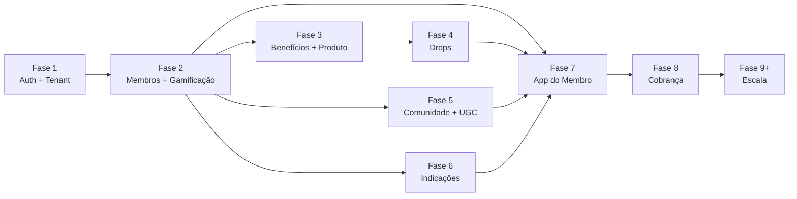

# Roadmap — Klub Members

> Documento vivo. Versão 0.1 — 2026-08-19. Complementa [PRD.md](PRD.md) §10 (que dá a
> visão macro MVP/V1/V2/Futuro) com passos concretos, em ordem de execução.

## Onde estamos (Fase 0 — concluída)

- Scaffold Next.js + TypeScript + Tailwind v4 + Drizzle, tema escuro estilo Hubla.
- Shell do lado do lojista: sidebar com os 8 pilares + Configurações.
- Dashboard com todos os KPIs do PRD §4.1 — **dados mockados**, sem ligação com banco.
- Schema Drizzle (14 tabelas) migrado no Neon — banco existe, mas nenhuma tela ainda
  lê/escreve nele.
- Infra no ar: GitHub (`ojhondev/klub`), Vercel (`klub-one.vercel.app`), Neon
  (`neon-cobalt-globe`).
- **Sem autenticação.** Qualquer pessoa que acessa a URL vê o dashboard de uma loja
  fictícia — não há login, não há isolamento real de tenant ainda.

---

## Fase 1 — Fundação: autenticação + tenant + dados reais ✅ concluída (2026-08-19)

Sem isso, nada do resto pode sair do mock. É a fase mais estrutural e a que menos
"aparece" visualmente.

- ✅ **Login do lojista** — cadastro (`/cadastro`) + login (`/login`) por e-mail/senha,
  cookie de sessão assinado (HMAC-SHA256 + `SESSION_SECRET`) e hash de senha (scrypt),
  sem provedor externo — `src/lib/auth/`.
- ✅ **Onboarding da loja** — cadastro cria `lojas` (nome, slug único gerado
  automaticamente, plano `basico` por padrão) e `usuarios` (vinculado à loja) na mesma
  ação — `src/app/(auth)/actions.ts`.
- ✅ **Resolução de tenant por sessão** — `(lojista)/layout.tsx` exige sessão válida
  (`requireSession`, redireciona pra `/login` se ausente) e resolve `loja_id` a partir
  dela; nome da loja exibido no header, com botão "Sair".
- ✅ **Trocar o Dashboard de mock para real** — `src/lib/queries/dashboard.ts` calcula
  os KPIs direto das tabelas (`membros`, `compras`, `posts`, `indicacoes`) filtrados por
  `loja_id`. Numa loja nova a maioria vem zerada, como esperado; "LTV dos não membros"
  e "CAC economizado" ficam como "—" porque não há fonte de dado pra eles ainda (MVP
  sem webhook de pedido — ver PRD §11); Klub Growth Score também fica como "—" até
  existir dado suficiente pra calcular a fórmula do PRD §4.1.

**Verificado nesta sessão:** cadastro cria loja+usuário e loga automaticamente, logout
limpa a sessão, login com credencial errada mostra erro, login correto volta ao
dashboard. Isolamento entre lojas ainda não foi testado com duas contas simultâneas
(fica pra Fase 2, quando `membros` reais existirem pra comparar).

**Pronto quando:** dá pra criar duas contas de loja diferentes, logar em cada uma, e
ver que os dados de uma não vazam pra outra.

---

## Fase 2 — Membros (CRM) + Gamificação ✅ concluída (2026-08-19)

As duas telas que sustentam o pilar **Rewards** — e o que dá ao lojista algo
imediatamente útil de configurar.

- ✅ **Gamificação** (substituiu o placeholder): CRUD de Níveis (ícone, nome, XP
  necessário, ordem) e de Regras de XP (ação → valor + descrição) —
  `src/app/(lojista)/gamificacao/`. Criar + remover implementados; editar in-place
  ficou de fora do escopo (recriar via remover+adicionar cobre o MVP). Conquistas
  adiada — não entrou nesta fase.
- ✅ **Membros** (substituiu o placeholder): listagem real com os filtros do PRD §4.2
  (Todos/VIP/Inativos/Novos/Recorrentes/Top clientes, via `?filtro=`) e perfil
  individual (`/membros/[id]`) com nível, XP e histórico de compras —
  `src/lib/queries/membros.ts`. VIP = membros no nível de maior `ordem`; Inativos =
  sem compra nos últimos 90 dias; Recorrentes = 2+ compras. Cupons/indicações/UGC no
  perfil ficam pra quando essas fases existirem (Fase 3/5/6).
- ✅ **Página pública de adesão** (decisão do PRD §5.0) — `src/app/j/[slug]/page.tsx`,
  fora dos route groups `(auth)`/`(lojista)` (pública, sem sessão). Cliente se
  cadastra com nome+e-mail, vira `membro` já no nível inicial (menor `ordem`), sem
  duplicar por e-mail. Link exibido e clicável direto na tela de Membros do lojista.
- ✅ **Registrar ação** (adição não prevista no roadmap original, necessária pra
  fechar o loop de ponta a ponta sem esperar a Fase 9/integração real) — botão no
  perfil do membro que aplica a regra de XP de uma ação (`src/lib/gamificacao.ts` →
  `resolveNivel`) e, se a ação for "compra", registra em `compras` com
  `origem: "direta"`. É o substituto manual do webhook de pedido que não existe no
  MVP — mesma lógica de "link manual" já adotada em outras partes do PRD.

**Verificado nesta sessão, ponta a ponta:** criar 2 níveis (Bronze 0 XP, Gold 300 XP)
+ 1 regra (Comprar → +100 XP) → cliente se cadastra via `/j/<slug>` e entra em Bronze
→ aparece em Membros → 3 "compras" registradas via "Registrar ação" somam 300 XP →
sobe automaticamente para Gold → filtros VIP e Recorrentes retornam o membro
corretamente → Dashboard reflete a receita e taxa de recompra reais.

**Pronto quando:** um cliente consegue entrar em `/j/<slug>`, se cadastrar, e aparecer
na lista de Membros do lojista; o lojista consegue criar um nível, o membro acumular
XP por uma ação e subir de nível — tudo refletido na tela de Membros.

---

## Fase 3 — Benefícios + cadastro de produto (link manual) ✅ concluída (2026-08-19)

- ✅ **Benefícios** (substituiu o placeholder): CRUD (criar/remover) dos 7 tipos do
  PRD §4.4 (cupom, cashback, frete grátis, brinde, desconto, produto exclusivo,
  acesso antecipado), com público-alvo por nível (ou "Todos os níveis") —
  `src/app/(lojista)/beneficios/`.
- ✅ **Cadastro de produto via link** — nova tabela `produtos` (nome, preço, link,
  imagem) e tela em **Configurações** (que também deixou de ser placeholder) —
  `src/app/(lojista)/configuracoes/`. Decisão de IA: produto não ganhou item próprio
  na sidebar (ficaria fora dos 8 pilares do PRD) — mora em Configurações, de onde
  Drops (Fase 4) vai puxar.
- ✅ **Ajuste de schema não previsto no roadmap original:** `drops.produtoNome` +
  `drops.produtoLink` (texto livre, do desenho inicial do Fase 0) foram substituídos
  por `drops.produtoId` (referência a `produtos`), já que agora existe uma entidade de
  produto de verdade para Drops referenciar em vez de repetir texto solto por drop.
  Migração feita em duas etapas (`0002`/`0003`) para evitar a detecção ambígua de
  "rename" do drizzle-kit ao remover+adicionar colunas na mesma tabela — tabela
  `drops` estava vazia, sem risco de perda de dado.

**Verificado nesta sessão:** produto "Tênis Runner Pro" (R$399,90) cadastrado via
link; nível "Platinum" criado e benefício "Frete grátis Platinum" associado a ele,
aparecendo corretamente na listagem com o público-alvo certo; remoção testada e
funcionando em ambos.

**Pronto quando:** existe um benefício configurado e associado a um nível, e pelo
menos um produto cadastrado via link pronto para ser usado num Drop.

---

## Fase 4 — Drops

- **Drops** (substituir o placeholder): criar drop (produto, data/hora de liberação,
  público-alvo por nível, benefício, estoque), listagem de drops ativos/futuros/
  encerrados, e o resultado pós-drop (% vendido) alimentando o Dashboard.
- **Atribuição de pedido "originado pelo Klub"** — implementar o cupom/UTM único por
  membro ou por drop (decisão do PRD §6), já que não há webhook de pedido no MVP.

**Pronto quando:** um drop criado no admin aparece corretamente restrito ao nível
configurado e o "% vendido pelo Klub" bate com os pedidos atribuídos.

---

## Fase 5 — Comunidade + UGC

Normalmente a fase mais cara de moderar, por isso vem depois das anteriores estarem
sólidas.

- **Comunidade** (substituir o placeholder): feed, posts, comentários, curtidas,
  denúncias, moderação, fixar post/campanha/produto/desafio, hashtags.
- **UGC** (substituir o placeholder): visão dedicada de fotos/vídeos vindos da
  comunidade, aprovação, destaque, "Top UGC do mês", solicitação de autorização de uso.

**Pronto quando:** um post de membro pode ser fixado pelo lojista, moderado, e
aparecer destacado na aba UGC.

---

## Fase 6 — Indicações

- **Indicações** (substituir o placeholder): criação de campanha de referral
  (recompensa do indicado + XP do indicador), geração de link/código por membro,
  dashboard de convites → cliques → cadastros → compras → CAC estimado (PRD §4.8).

**Pronto quando:** um membro indicado se cadastra através do link, e isso aparece no
funil da campanha no admin.

---

## Fase 7 — App do membro (lado consumidor)

Até aqui, tudo foi o lado do lojista. Esta fase entrega a experiência descrita no PRD
§5 para quem é membro: Home/Feed, Perfil/Progresso, Loja/Catálogo, Drops, Comunidade,
Indique e ganhe, Carteira de benefícios, Notificações. Mobile-first, sem PWA — mesmo
padrão de acabamento do admin (referência Hubla).

**Pronto quando:** um membro logado consegue ver seu nível/XP, participar de um drop
liberado pra ele, postar na comunidade e resgatar um benefício da carteira.

---

## Fase 8 — Cobrança do lojista (assinatura)

- Implementar o checkout de assinatura dos 3 planos (R$97/297/597) e o gate de
  funcionalidades por plano (tabela do PRD §7, ainda draft — precisa ficar definitiva
  antes desta fase).
- Provedor de pagamento a definir (mesma decisão que o Stokys já resolveu com Asaas —
  avaliar reaproveitar).

**Pronto quando:** uma loja nova só acessa Drops/Comunidade se estiver no plano que
libera esse pilar, e o upgrade de plano muda isso em tempo real.

---

## Fase 9 e além — Escala

Itens que o PRD já marca como "Futuro" e não bloqueiam nenhuma fase anterior:

- Integração via API/OAuth oficial com Shopify e Nuvemshop (catálogo sincronizado,
  baixa de estoque em tempo real, cupom nativo) — substitui o link manual da Fase 3.
- Klub Growth Score: sair da fórmula v0 (PRD §4.1) para uma calibrada com dados reais
  de lojas piloto.
- Moderação de comunidade assistida por IA (v1 é 100% manual — ver limite no PRD §11).
- App nativo publicado (iOS/Android), se o padrão de acabamento web não for suficiente.

---

## Ordem de dependência (resumo)

A Fase 1 é o único bloqueador linear real — todo o resto depende dela. Fases 3, 5 e 6
podem ser reordenadas entre si sem grande atrito; a única dependência forte é Fase 3
(produto cadastrado) antes da Fase 4 (Drop precisa de um produto pra vincular).
